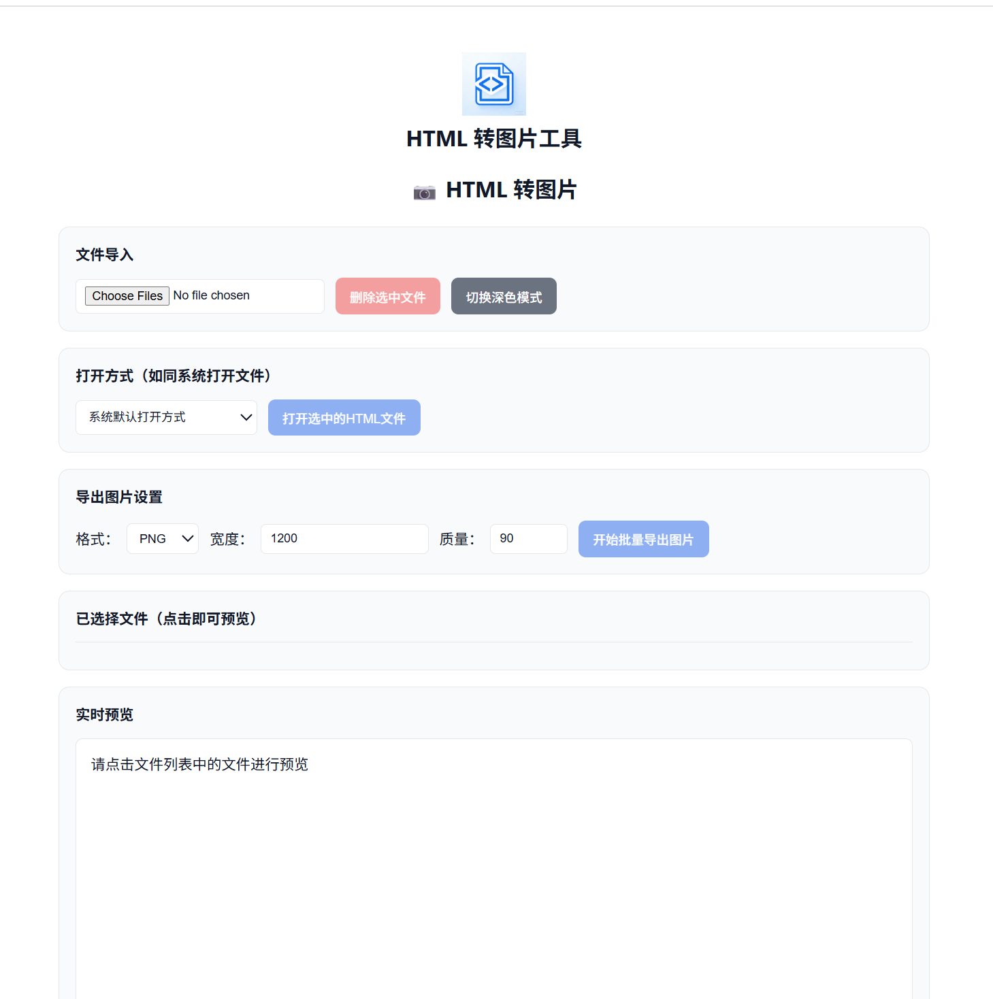
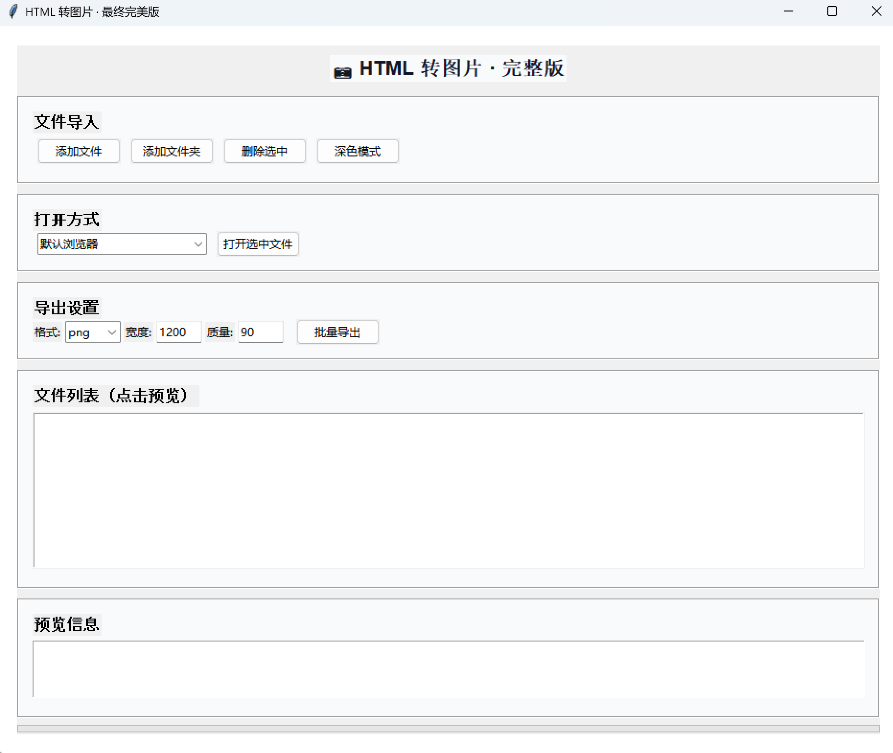

# 🖼️ HTML 转图片工具 / HTML to Image Tool
一款功能完整、开箱即用的 HTML 转高清图片工具，提供本地 Python 客户端与在线网页双版本，支持批量转换、自定义导出、实时预览与深色模式。

[](https://github.com/SomeH-Bosx/html2img-tool/stargazers)
[](https://github.com/SomeH-Bosx/html2img-tool/blob/main/LICENSE)
[](https://someh-bosx.github.io/html2img-tool/)

---

## 📋 目录 / Table of Contents
- [项目简介](#项目简介)
- [核心功能](#核心功能)
- [在线体验](#在线体验)
- [项目截图](#项目截图)
- [本地运行](#本地运行)
- [直接下载EXE（免安装）](#直接下载EXE（免安装）)
- [安装依赖](#安装依赖)
- [贡献指南](#贡献指南)
- [许可证](#许可证)

---

## 项目简介📖 
本项目实现了 HTML 页面一键转图片功能，分为两个版本：
- **在线网页版**：纯前端 JavaScript 实现，部署于 GitHub Pages，无需安装，浏览器直接使用
- **本地桌面版**：基于 Python + Tkinter + Playwright，支持批量 HTML 导入、自定义尺寸质量、深色模式

工具可自动处理本地图片资源，适合前端开发者、设计师、学生课程设计与日常快速转换使用。

---

## 核心功能✨ 
- 批量导入 HTML 文件 / 文件夹
- 自定义导出格式：PNG / JPG
- 自定义图片宽度与质量
- 实时预览 HTML 内容
- 深色模式 / 浅色模式切换
- 多种方式打开源文件（浏览器、VS Code、记事本）
- 自动将本地图片转为 Base64
- 在线直接使用，无需环境依赖

---

## 在线体验🚀 
直接访问即可使用：
👉 **https://someh-bosx.github.io/html2img-tool/**

---


## 直接下载EXE（免安装）📥  
点击下方按钮即可下载 Windows 版本，双击运行，无需安装 Python：
[](https://github.com/SomeH-Bosx/html2img-tool/raw/main/dist/HTML%E8%BD%AC%E5%9B%BE%E5%B7%A5%E5%85%B7%E5%85%B7.exe)

## 项目截图📸 
### 在线网页版界面


### 本地桌面版界面



---

## 本地运行💻 
### 环境要求
- Python 3.7 ~ 3.11
- Windows / macOS / Linux 全平台支持

### 安装依赖
```bash
pip install -r requirements.txt
playwright install chromium
```

## 贡献指南🤝
1. Fork 本项目
2. 创建功能分支：git checkout -b feature/xxx
3. 提交修改：git commit -m "Add xxx"
4. 推送分支：git push origin feature/xxx
5. 提交 Pull Request

## 许可证📄
本项目基于 MIT License 开源。
